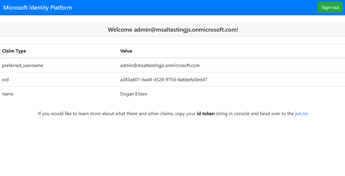

# Vanilla JavaScript single-page application using MSAL.js to authenticate users with Azure Active Directory

* [Overview](#overview)
* [Scenario](#scenario)
* [Contents](#contents)
* [Prerequisites](#prerequisites)
* [Setup the sample](#setup-the-sample)
* [Explore the sample](#explore-the-sample)
* [About the code](#about-the-code)
* [Next Steps](#next-steps)
* [Contributing](#contributing)
* [Learn More](#learn-more)

## Overview

This sample demonstrates a Vanilla JavaScript single-page application (SPA) that lets users sign-in to [Azure Active Directory](https://docs.microsoft.com/azure/active-directory/fundamentals/active-directory-whatis) (Azure AD) using the [Microsoft Authentication Library for JavaScript](https://github.com/AzureAD/microsoft-authentication-library-for-js) (MSAL.js). In doing so, it also illustrates various authentication concepts, such as [ID Tokens](https://docs.microsoft.com/azure/active-directory/develop/id-tokens), [OIDC scopes](https://docs.microsoft.com/azure/active-directory/develop/v2-permissions-and-consent#openid-connect-scopes), [single-sign on](https://docs.microsoft.com/azure/active-directory/develop/msal-js-sso), **account selection**, **silent requests** and more.

## Scenario

1. The client application uses **MSAL.js** to sign-in a user and obtain an **ID Token** from **Azure AD**.
2. The **ID Token** proves that the user has successfully signed-in with their organization's tenant.

## Contents

| File/folder           | Description                                                               |
|-----------------------|---------------------------------------------------------------------------|
| `AppCreationScripts/` | Contains Powershell scripts to automate app registration.                 |
| `App/authPopup.js`    | Main authentication logic resides here (using popup flow).                |
| `App/authRedirect.js` | Use this instead of `authPopup.js` for authentication with redirect flow. |
| `App/authConfig.js`   | Contains configuration parameters for the sample.                         |
| `App/ui.js`           | Contains UI logic.                                                        |
| `server.js`           | Simple Node server for `index.html`.                                      |

## Prerequisites

- VS Code
    Addons: ms-vscode-remote.remote-containers
- Docker


## Setup the sample

### Step 1: Clone or download this repository

From your shell or command line:

```console
git clone <repo-url>
```

### Step 2: Install project dependencies

```console
    cd SPA
    npm install
```

#### Choose the Azure AD tenant where you want to create your applications

To manually register the apps, as a first step you'll need to:

1. Sign in to the [Azure portal](https://portal.azure.com).
1. If your account is present in more than one Azure AD tenant, select your profile at the top right corner in the menu on top of the page, and then **switch directory** to change your portal session to the desired Azure AD tenant.

#### Register the client app (ms-identity-javascript-c1s1)

1. Navigate to the [Azure portal](https://portal.azure.com) and select the **Azure Active Directory** service.
1. Select the **App Registrations** blade on the left, then select **New registration**.
1. In the **Register an application page** that appears, enter your application's registration information:
    1. In the **Name** section, enter a meaningful application name that will be displayed to users of the app, for example `ms-identity-javascript-c1s1`.
    1. Under **Supported account types**, select **Accounts in this organizational directory only**
    1. Select **Register** to create the application.
1. In the **Overview** blade, find and note the **Application (client) ID**. You use this value in your app's configuration file(s) later in your code.
1. In the app's registration screen, select the **Authentication** blade to the left.
1. If you don't have a platform added, select **Add a platform** and select the **Single-page application** option.
    1. In the **Redirect URI** section enter the following redirect URIs:
        1. `http://localhost:3000`
        1. `http://localhost:3000/redirect`
    1. Click **Save** to save your changes.

##### Configure Optional Claims

1. Still on the same app registration, select the **Token configuration** blade to the left.
1. Select **Add optional claim**:
    1. Select **optional claim type**, then choose **ID**.
    1. Select the optional claim **acct**.
    > Provides user's account status in tenant. If the user is a **member** of the tenant, the value is *0*. If they're a **guest**, the value is *1*.
    1. Select **Add** to save your changes.

##### Configure the client app (ms-identity-javascript-c1s1) to use your app registration

Open the project in your IDE (like Visual Studio or Visual Studio Code) to configure the code.

> In the steps below, "ClientID" is the same as "Application ID" or "AppId".

1. Open the `App\authConfig.js` file.
1. Find the key `Enter_the_Application_Id_Here` and replace the existing value with the application ID (clientId) of `ms-identity-javascript-c1s1` app copied from the Azure portal.
1. Find the key `Enter_the_Tenant_Info_Here` and replace the existing value with your Azure AD tenant/directory ID.

### Step 4: Running the sample

```console
    cd 1-Authorization\1-sign-in
    npm start
```

## Explore the sample

1. Open your browser and navigate to `http://localhost:3000`.
1. Click the **sign-in** button on the top right corner.




## About the code

## Sign-in

MSAL.js provides 3 login APIs: `loginPopup()`, `loginRedirect()` and `ssoSilent()`:

```javascript
    myMSALObj.loginPopup(loginRequest)
        .then((response) => {
            // your logic
        })
        .catch(error => {
            console.error(error);
        });
```

To use the redirect flow, you must register a handler for redirect promise. **MSAL.js** provides`handleRedirectPromise()` API:

```javascript
    myMSALObj.handleRedirectPromise()
        .then((response) => {
            // your logic
        })
        .catch(err => {
            console.error(err);
        });

    myMSALObj.loginRedirect(loginRequest);
```

The recommended pattern is that you fallback to an **interactive method** should the silent SSO fails.

```javascript

    const silentRequest = {
      scopes: ["openid", "profile"],
      loginHint: "example@domain.net"
    };

    myMSALObj.ssoSilent(silentRequest)
        .then((response) => {
            // your logic
        }).catch(error => {
            console.error("Silent Error: " + error);
            if (error instanceof msal.InteractionRequiredAuthError) {
                myMSALObj.loginRedirect(loginRequest);
            }
        });
```

You can get all the active accounts of a user with the get `getAllAccounts()` API. If you know the **username** or **home ID** of an account, you can select it by:

```javascript
    myMSALObj.getAccountByUsername(username);
    // or
    myMSALObj.getAccountByHomeId(homeId);
```

### Sign-out

The Application redirects the user to the **Microsoft identity platform** logout endpoint to sign out. This endpoint clears the user's session from the browser. If your app did not go to the logout endpoint, the user may re-authenticate to your app without entering their credentials again, because they would have a valid single sign-in session with the **Microsoft identity platform** endpoint. For more, see: [Send a sign-out request](https://docs.microsoft.com/azure/active-directory/develop/v2-protocols-oidc#send-a-sign-out-request)

### ID Token Validation

A single-page application does not benefit from validating ID tokens, since the application runs without a back-end and as such, attackers can intercept and edit the keys used for validation of the token.

### Sign-in Audience and Account Types

This sample is meant to work with accounts in your organization (aka *single-tenant*). If you would like to allow sign-ins with other type accounts, you have to configure your `authority` string in `authConfig.js` accordingly. For example:

```javascript
const msalConfig = {
    auth: {
      clientId: "<YOUR_CLIENT_ID>",
      authority: "https://login.microsoftonline.com/consumers", // allows sign-ins with personal Microsoft accounts.
      redirectUri: "<YOUR_REDIRECT_URI>",
    },
```

For more information about audiences and account types, please see: [Validation differences by supported account types (signInAudience)](https://docs.microsoft.com/azure/active-directory/develop/supported-accounts-validation)
